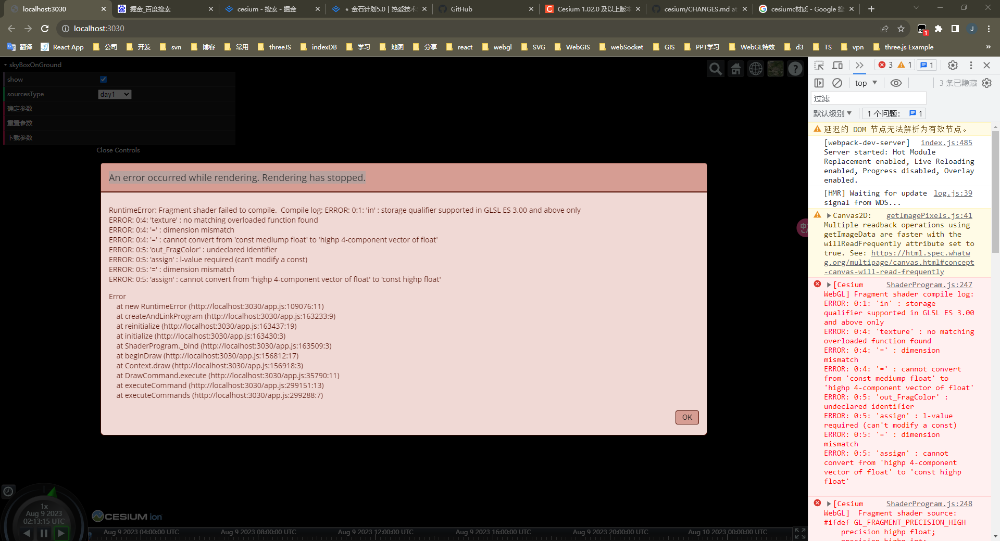

# 解决 Cesium(版本 1.99.0 )开发中遇到 ERROR: 0:1: 'in' : storage qualifier supported in GLSL ES 3.00 and above only 问题

> 本篇记录了我在使用`Cesium.SkyBox`源码更换天空盒图片时，却遇到 Fragment 着色器编译失败的问题。
> 问题：已解决。
> - [查看地址](https://cesium-sky-box-on-ground.vercel.app/)
> - [仓库地址](https://github.com/WaterSeeding/CesiumSkyBoxOnGround)

<br />

## 来源



如图所示，这个错误导致了我程序渲染停止了，而且报出提示：

编译日志:ERROR: 0:1: 'in':存储限定符仅在 GLSL 3.00 及以上版本中支持。

这个说的话，这个问题，应该 GLSL 代码和 GLSL 版本有关。

<br />

## 排查

程序之所以会出现这个问题，是因为我添加了一个`SkyBoxOnGround.js`的文件，因为是 GLSL 代码问题，我立即锁定到相应位置上：

```jsx
//片元着色器，直接从源码复制
let SkyBoxFS = `uniform samplerCube u_cubeMap;
  in vec3 v_texCoord;
  void main()
  {
    vec4 color = texture(u_cubeMap, normalize(v_texCoord));
    out_FragColor = vec4(czm_gammaCorrect(color).rgb, czm_morphTime);
  }
`;

//顶点着色器有修改，主要是乘了一个旋转矩阵
let SkyBoxVS = `
  uniform mat3 u_rotateMatrix;
  in vec3 position;
  out vec3 v_texCoord;
  void main()
  {
    vec3 p = czm_viewRotation * u_rotateMatrix * (czm_temeToPseudoFixed * (czm_entireFrustum.y * position));
    gl_Position = czm_projection * vec4(p, 1.0);
    v_texCoord = position.xyz;
  }
 `;

export { SkyBoxFS, SkyBoxVS };
```

这两段`GLSL`着色器代码是我从`Cesium`库中直接拷贝修改的。


其中唯一修改的位置是：顶点着色器中的，片元着色器基本不变。

```jsx
uniform mat3 u_rotateMatrix;
```

```jsx
vec3 p = czm_viewRotation * u_rotateMatrix * (czm_temeToPseudoFixed * (czm_entireFrustum.y * position));
```

思考了很久，我得出以下结论：

我只是使用`uniform`关键字引入`GLSL`常量，没有报错，而直接复制`Cesium`源码的`Shader`代码里的`in`关键字却报错了。

是不是我的`Cesium`不同版本影响的？

于是乎，我查看了下我程序的`Cesium`版本号：

1.99.0


而我引入的那份代码是:

1.102


这之间差了不少版本了！！！

<br />

## 解难

> 于是乎，我找到`Cesium.js`源码是 1.99.0 的相关 GLSL 内容。

1. 复制`SkyBoxFS.glsl`和`SkyBoxVS.glsl`代码内容

```jsx
uniform samplerCube u_cubeMap;

varying vec3 v_texCoord;

void main() {
  vec4 color = textureCube(u_cubeMap, normalize(v_texCoord));
  gl_FragColor = vec4(czm_gammaCorrect(color).rgb, czm_morphTime);
}
```

```jsx
attribute vec3 position;

varying vec3 v_texCoord;

void main() {
  vec3 p = czm_viewRotation * (czm_temeToPseudoFixed * (czm_entireFrustum.y * position));
  gl_Position = czm_projection * vec4(p, 1.0);
  v_texCoord = position.xyz;
}
```

2. 修改顶点着色器，主要是乘了一个旋转矩阵

```jsx
uniform mat3 u_rotateMatrix;
attribute vec3 position;
varying vec3 v_texCoord;

void main() {
  vec3 p = czm_viewRotation * u_rotateMatrix * (czm_temeToPseudoFixed * (czm_entireFrustum.y * position));
  gl_Position = czm_projection * vec4(p, 1.0);
  v_texCoord = position.xyz;
}
```

3. 重新运行程序代码。

<br />

## 使用

后面，我又根据思路重新整合，完美解决当前这个问题，效果如下：


<br />

## 结论

看来`Cesium`1.99.0 和 1.102 版本之前，所使用的 GLSL 代码版本是不一样的，才导致文章提到的这个问题：

```jsx
ERROR: 0:1: 'in' : storage qualifier supported in GLSL ES 3.00 and above only
```

其中的`in`关键字是 GLSL3.0 和 2.0 的差别，具体可以查阅以下[文章](https://blog.csdn.net/stone_gentle/article/details/128689189)：


<br />

## 相关资料

- [Cesium](https://cesium.com/)
- [Cesium Documentation](https://cesium.com/docs/)
- [OpenGLES（四）glsl 语法](https://blog.csdn.net/stone_gentle/article/details/128689189)
