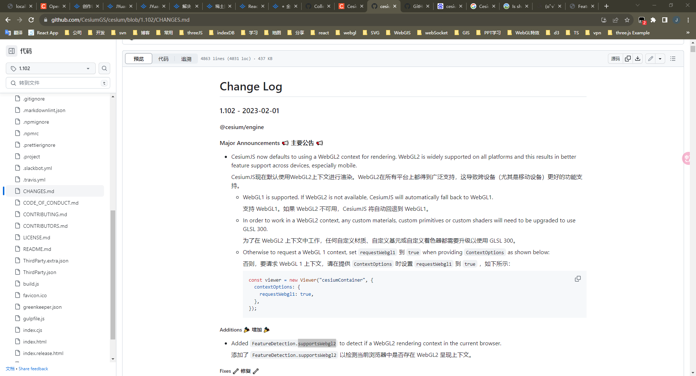
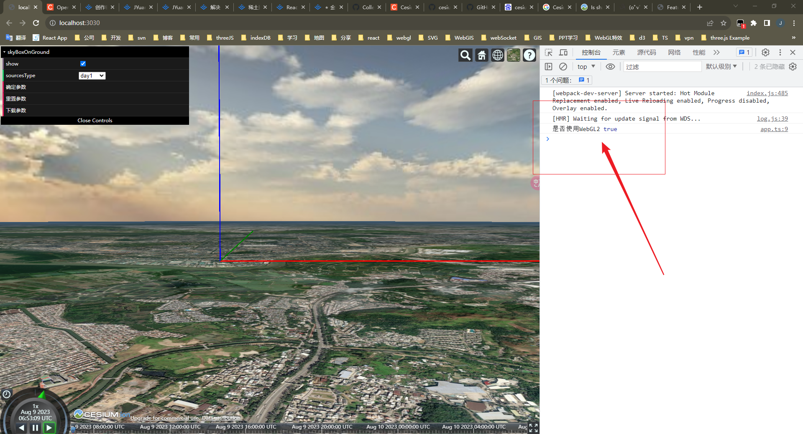
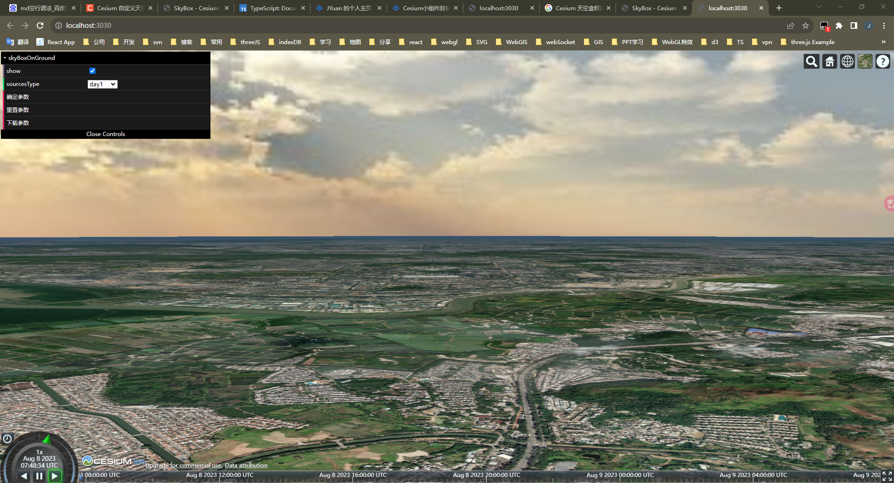

# 解决 Cesium 开发中遇到 Compile log: ERROR: 0:3: 'varying' : Illegal use of reserved word 问题

> 本篇记录了我在使用`Cesium.SkyBox`源码更换天空盒图片时，却遇到 Fragment 着色器编译失败的问题。
> 问题：已解决。

<br />

## 来源


如图所示，这个错误导致了我程序渲染停止了，而且报出提示：

编译日志:ERROR: 0:3: 'varying':非法使用保留字。

<br />

## 排查

我之前有一篇文章记录（[解决 Cesium(版本 1.99.0 )开发中遇到 ERROR: 0:1: 'in' : storage qualifier supported in GLS](https://juejin.cn/post/7264952002706128932)）：

该文描述了我使用 Cesium(版本 1.99.0)，编辑 GLSL(版本 3.0)代码时遇到的错误，这和我现在遇到的问题其实是一个方向，都是使用的 GLSL 版本的语法不兼容的问题。

之所以这么肯定是，因为我看到[`CesiumJS`官方更新日志](https://github.com/CesiumGS/cesium/blob/1.102/CHANGES.md):



如图所示，有几点必须标注出来：

1. `CesiumJS`在版本 1.102 以后默认使用 WebGL2 上下文进行渲染
2. 为了在 WebGL2 上下文中工作，任何自定义材质、自定义基元或自定义着色器都需要升级以使用 GLSL 300
3. 可以通过`Cesium.FeatureDetection.supportsWebgl2`来检测当前浏览器中是否存在 WebGL2 呈现上下文
4. 可以设置`ContextOptions.requestWebgl1`为`true`， 回退到 WebGL1 版本

## 查验

为了查证，当前版本的`CesiumJs`是不是使用 WebGL2 上下文渲染的，我通过 API`Cesium.FeatureDetection.supportsWebgl2(viewer.scene)`来测试:



如图所示，的确当前版本的`CesiumJs`的确使用 WebGL2 上下文渲染，从而任何自定义材质、自定义基元或自定义着色器都需要升级以使用 GLSL 300，而 GLSL3.0 与 2.0 差异中就是有:

```jsx
用 in 和 out 取代 attribute 和 varying
```

<br />

## 解难

> 于是乎，我排查出原因后，后面的操作就很简单了，有两种方式。

1. 设置`ContextOptions.requestWebgl1`为`true`， 回退到 WebGL1 版本，使用 GLSL 2.0 的代码

```jsx
const options: Viewer.ConstructorOptions = {
  infoBox: false,
  selectionIndicator: false,
  shadows: true,
  shouldAnimate: true,
  contextOptions: {
    requestWebgl1: false,
  },
};

export const viewer = new Viewer("cesium-container", options);
```

```jsx
// 片元着色器
uniform samplerCube u_cubeMap;

varying vec3 v_texCoord;

void main() {
  vec4 color = textureCube(u_cubeMap, normalize(v_texCoord));
  gl_FragColor = vec4(czm_gammaCorrect(color).rgb, czm_morphTime);
}
```

```jsx
// 顶点着色器
uniform mat3 u_rotateMatrix;
attribute vec3 position;
varying vec3 v_texCoord;

void main() {
  vec3 p = czm_viewRotation * u_rotateMatrix * (czm_temeToPseudoFixed * (czm_entireFrustum.y * position));
  gl_Position = czm_projection * vec4(p, 1.0);
  v_texCoord = position.xyz;
}
```

2. 将 GLSL 2.0 代码修改升级为 GLSL3.0 的，完美展示 WebGL2 的渲染效果

```jsx
// 片元着色器
in vec3 v_texCoord;
void main()
{
  vec4 color = texture(u_cubeMap, normalize(v_texCoord));
  out_FragColor = vec4(czm_gammaCorrect(color).rgb, czm_morphTime);
}
```

```jsx
// 顶点着色器
uniform mat3 u_rotateMatrix;
in vec3 position;
out vec3 v_texCoord;
void main()
{
  vec3 p = czm_viewRotation * u_rotateMatrix * (czm_temeToPseudoFixed * (czm_entireFrustum.y * position));
  gl_Position = czm_projection * vec4(p, 1.0);
  v_texCoord = position.xyz;
}
```

<br />

## 使用

>后面，根据思路重新整合，完美解决当前这个问题，效果如下：
> - [查看地址](https://cesium-sky-box-on-ground.vercel.app/)
> - [仓库地址](https://github.com/WaterSeeding/CesiumSkyBoxOnGround)




<br />

## 结论

看来`Cesium`1.99.0 和 1.102 版本之前，所使用的 GLSL 代码版本是不一样的，才导致文章提到的这个问题：

<br />

## 相关资料

- [Cesium](https://cesium.com/)
- [Cesium Documentation](https://cesium.com/docs/)
- [OpenGLES（四）glsl 语法](https://blog.csdn.net/stone_gentle/article/details/128689189)
- [Cesium 1.02.0 及以上版本下自定义材质报错](https://blog.csdn.net/linzi19900517/article/details/129424356)
