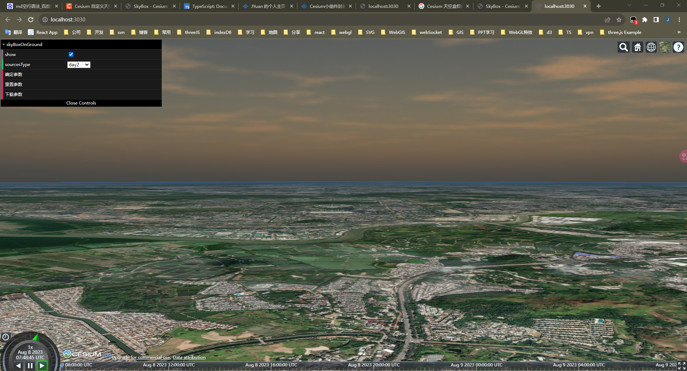

# 1.1 解决 Cesium.SkyBox 天空盒在近地面水平天际线视角下，倾斜问题（倾斜错误）

> 本篇记录了我在使用`Cesium.SkyBox`更换天空盒图片时，却遇到图片（方位）位置无法正常显示的问题。
> 问题：已解决。

<br />

## 来源

因为我时常在项目中使用到`Cesium.SkyBox`的功能，为了方面使用，就封装了一个（GUI 可控的）[`SkyBox`组件](https://github.com/WaterSeeding/CesiumSkyBox)，可是在使用中，却遇到这么个问题:


可以明显得看出来，天都倾斜，云朵下坠。太奇怪了................


<br />

## 排查

一开始，我觉得自己没有正确使用`Cesium.SkyBox`的 API，或者某些属性我没有设置正确，可是我再次仔细阅读文档：


并使用`console.log`和断点测试参数和代码，反复试验，觉得 API 的使用应该没有问题，符合文档的描述。

那么问题会不会是`Cesium`自身的局限导致的，我又搜索了一下相关资源，发现遇到这个问题的人还是不少的：


<br />

## 解难

> 于是乎，我借鉴了这篇文章（[Cesium 自定义天空盒 近地时角度错误](https://blog.csdn.net/baidu_36872367/article/details/103805633)）的思路来解决问题。
> 这篇文章的作者是修改源码，重新打包一份`Cesium.js`库的形式，我不是很想修改源代码，担心产生其他奇奇怪怪的问题。
> 我的方式是，新建一个`Cesium.SkyBox`变体，修改它相关的内容，达到我的需求，然后使用它，来替代使用`Cesium.SkyBox`。

1. 复制一份源代码`SkyBox.js`，以及相关的方法类
   

2. 设置天空盒绘制 Shader 的`uniform`资源

```jsx
command.uniformMap = {
  u_cubeMap: function () {
    return that._cubeMap;
  },
  u_rotateMatrix: function () {
    if (!Cesium.defined(Cesium.Matrix4.getRotation)) {
      return Cesium.Matrix4.getMatrix3(command.modelMatrix, skyboxMatrix3);
    }
    return Cesium.Matrix4.getRotation(command.modelMatrix, skyboxMatrix3);
  },
};
```

3. 修改天空盒绘制 Shader 程序的代码:

```jsx
if (!Cesium.defined(command.shaderProgram) || this._useHdr !== useHdr) {
  let fs = new Cesium.ShaderSource({
    defines: [useHdr ? "HDR" : ""],
    sources: [SkyBoxFS],
  });
  command.shaderProgram = Cesium.ShaderProgram.fromCache({
    context: context,
    vertexShaderSource: SkyBoxVS,
    fragmentShaderSource: fs,
    attributeLocations: this._attributeLocations,
  });
  this._useHdr = useHdr;
}
```

```jsx
//片元着色器
let SkyBoxFS = `uniform samplerCube u_cubeMap;
  in vec3 v_texCoord;
  out vec4 v_fragColor;
  void main()
  {
  vec4 color = texture(u_cubeMap, normalize(v_texCoord));
  v_fragColor = vec4(czm_gammaCorrect(color).rgb, czm_morphTime);
  }
`;

//顶点着色器
let SkyBoxVS =
  `uniform mat3 u_rotateMatrix;\n\
    in vec3 position;\n\
    out vec3 v_texCoord;\n\
    void main()\n\
    {\n\
    vec3 p = czm_viewRotation * u_rotateMatrix * (czm_temeToPseudoFixed * (czm_entireFrustum.y * position));\n\
    gl_Position = czm_projection * vec4(p, 1.0);\n\
    v_texCoord = position.xyz;\n\
    }\n\`
```

这就完成了，我将这个`Cesium.SkyBox`变体命名为`SkyBoxOnGround`，接下来就是测试使用了。

> 这里的片元着色器和顶点着色器和源码有些不一样，是因为 WebGL 的版本不一样而修改的，后面我会讲解下。

## 使用

后面，我又根据原本封装`SkyBox`的思路重新整合封装了一个新的[`SkyBoxOnGround`组件](https://github.com/WaterSeeding/CesiumSkyBoxOnGround)，以下就是使用效果：

```jsx
import "./app.css";
import * as dat from "dat.gui";
import { viewer } from "./main";
import Scene from "./Scene/index";
import SkyBoxOnGround from "./SkyBoxOnGround/index";
import Camera from "./Camera/index";

const gui = new dat.GUI({
  name: "Cesium GUI",
  width: 450,
  autoPlace: true,
  closed: false,
});
gui.domElement.id = "gui";
gui.show();

viewer.scene.skyAtmosphere.show = false;

const camera = new Camera(
  viewer,
  gui,
  {
    position: {
      longitude: 114.056178,
      latitude: 22.46328,
      height: 500,
    },
    headingPitchRoll: {
      heading: 0.0,
      pitch: -3,
      roll: 0.0,
    },
  },
  true
);

const scene = new Scene(viewer, gui);
const skyBox = new SkyBoxOnGround(
  viewer,
  gui,
  {
    show: true,
    sourcesType: "default",
    sourcesList: [
      {
        name: "star1",
        sources: {
          positiveX: "./static/skybox/stars/00h+00.jpg",
          negativeX: "./static/skybox/stars/12h+00.jpg",
          positiveY: "./static/skybox/stars/06h+00.jpg",
          negativeY: "./static/skybox/stars/18h+00.jpg",
          positiveZ: "./static/skybox/stars/06h+90.jpg",
          negativeZ: "./static/skybox/stars/06h-90.jpg",
        },
      },
      {
        name: "star2",
        sources: {
          positiveX: "./static/skybox/stars/Version2_dark_px.jpg",
          negativeX: "./static/skybox/stars/Version2_dark_mx.jpg",
          positiveY: "./static/skybox/stars/Version2_dark_py.jpg",
          negativeY: "./static/skybox/stars/Version2_dark_my.jpg",
          positiveZ: "./static/skybox/stars/Version2_dark_pz.jpg",
          negativeZ: "./static/skybox/stars/Version2_dark_mz.jpg",
        },
      },
      {
        name: "star3",
        sources: {
          positiveX: "./static/skybox/stars/tycho2t3_80_pxs.jpg",
          negativeX: "./static/skybox/stars/tycho2t3_80_mxs.jpg",
          positiveY: "./static/skybox/stars/tycho2t3_80_pys.jpg",
          negativeY: "./static/skybox/stars/tycho2t3_80_mys.jpg",
          positiveZ: "./static/skybox/stars/tycho2t3_80_pzs.jpg",
          negativeZ: "./static/skybox/stars/tycho2t3_80_mzs.jpg",
        },
      },
      {
        name: "day1",
        sources: {
          positiveX: "./static/skybox/skys/rightav9.jpg",
          negativeX: "./static/skybox/skys/leftav9.jpg",
          positiveY: "./static/skybox/skys/frontav9.jpg",
          negativeY: "./static/skybox/skys/backav9.jpg",
          positiveZ: "./static/skybox/skys/topav9.jpg",
          negativeZ: "./static/skybox/skys/bottomav9.jpg",
        },
      },
      {
        name: "day2",
        sources: {
          positiveX: "./static/skybox/skys/SunSetRight.png",
          negativeX: "./static/skybox/skys/SunSetLeft.png",
          positiveY: "./static/skybox/skys/SunSetFront.png",
          negativeY: "./static/skybox/skys/SunSetBack.png",
          positiveZ: "./static/skybox/skys/SunSetUp.png",
          negativeZ: "./static/skybox/skys/SunSetDown.png",
        },
      },
      {
        name: "day3",
        sources: {
          positiveX: "./static/skybox/skys/Right.jpg",
          negativeX: "./static/skybox/skys/Left.jpg",
          positiveY: "./static/skybox/skys/Front.jpg",
          negativeY: "./static/skybox/skys/Back.jpg",
          positiveZ: "./static/skybox/skys/Up.jpg",
          negativeZ: "./static/skybox/skys/Down.jpg",
        },
      },
    ],
  },
  false
);
```





## 相关资料

- [Cesium 自定义天空盒 近地时角度错误](https://blog.csdn.net/baidu_36872367/article/details/103805633)
- [Cesium](https://cesium.com/)
- [Cesium Documentation](https://cesium.com/docs/)
